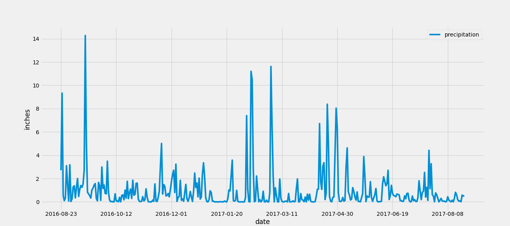
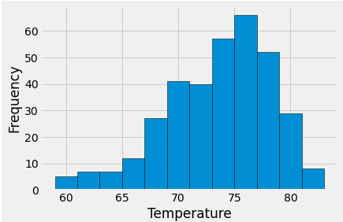

# sqlalchemy-challenge
Practice with sqlalchemy

## Objectives:
 1. Explore data set containing Hawaii weather measurements by station, containing date, observed temperature, and precipitation.  
 2. Identify whether data support Hawaii's reputation for mild weather.
 3. Build Climate API in Flask - design a Flask API based on the queries in Objective 1.
 
## Methodology
 1. Used SQL Alchemy to: connect to provided sqlite file, reflect tables, get metadata, and pass queries in both SQL and session queries to the SQL db. 
 
## Finding: 
Yes, Hawaii's famously mild weather deserves its reputation, with high temps almost always between 70 and 80F. Precipitation is frequent, but accumulation is usually minimal. Several high rain days in the past year of data, but they are less frequent than lower accumulation days. 

* Precipitation over time: 

* 12 month temperature distribution (histogram)

## Flask API:
1. Clone repository to local folder
2. Run app.py in Python environment
3. Point browser to http://127.0.0.1:5000/ or custom port as per system configuration

* Notes: error trapping not constructed on dynamic routes of API. To do: use try-catch to ensure dates are valid and between start date and end date. 
	this means that "null" will result from entering dates outside the range of the db, or a start date later than end date. Entering dates in any format beside ISO will return a HTTP 404 error
	
